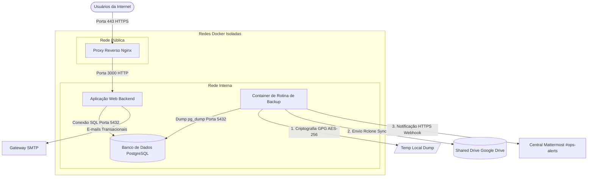

# Projeto BKP Rclone

[](#)
[](#)
[](#)
[](#)
[](#)

Como garantimos que os dados transacionais de nossa aplicação estejam sempre seguros e disponíveis diante de cenários de desastres ou falhas físicas? O **BKP Rclone** é um modelo arquitetural de orquestração de containers estruturado para executar rotinas automatizadas de backup seguindo a regra 3-2-1. Com criptografia simétrica GPG de nível militar, upload offsite direcionado ao Google Drive por meio do Rclone e centralização de notificações via webhooks do Mattermost, o sistema mitiga os riscos de perda de dados corporativos com alta previsibilidade e conformidade de segurança.

---

## 1. Arquitetura do Sistema

O diagrama abaixo demonstra a jornada dos dados de produção e o fluxo de segurança implementado. O tráfego de usuários passa pelo proxy reverso, enquanto o banco de dados e as ferramentas operacionais de backup residem em redes internas totalmente isoladas da internet pública.



---

## 2. Estrutura de Diretórios do Repositório

Abaixo está o mapeamento dos diretórios de trabalho e arquivos de configuração que compõem este repositório:

```
├── .env.example                # Modelo de variáveis de ambiente do projeto
├── README.md                   # Esta documentação principal
├── docker-compose.yml          # Arquivo de orquestração de containers Docker
├── docs/                       # Pasta central de documentação técnica
│   ├── ajuda_infra.md          # Manual de infraestrutura e orquestração
│   ├── diretrizes_documentacao.md # Diretrizes de governança de documentação
│   ├── estrategia_execucao.md  # Versionamento, deploys e rollbacks
│   ├── migration_guide.md      # Protocolo de migração de servidores
│   ├── politica_backup.md      # Regras de backup 3-2-1 e restore
│   ├── postmortem.md           # Análise blameless de incidentes
│   ├── prompt_ia.md            # System prompt permanente para IAs
│   └── troubleshooting.md      # Manual de diagnósticos de falhas comuns
├── scripts/
│   └── backup_run.sh           # Script Bash de automação do backup 3-2-1
└── data/                       # Diretório físico local de volumes persistentes (ignorado no Git)
```

---

## 3. Requisitos Mínimos do Sistema

Para provisionar e executar a infraestrutura localmente, garanta que os seguintes softwares estejam instalados e configurados no Host:

*   **Docker:** Versão 24.0.0 ou superior.
*   **Docker Compose:** Versão 2.20.0 ou superior.
*   **Rclone Configurado:** Configuração de um remote nomeado `gdrive:` associado a uma conta/Shared Drive institucional do Google Drive.
*   **Chave GPG de Criptografia:** Senha simétrica definida e armazenada em ambiente seguro.

---

## 4. Guia Rápido de Inicialização

Siga o roteiro passo a passo abaixo para inicializar a stack de desenvolvimento no servidor ou máquina local:

1.  Clone este repositório para o seu diretório de trabalho:
    ```bash
    git clone <URL_REPOSITORIO> BKP_Rclone
    cd BKP_Rclone
    ```
2.  Copie o modelo de variáveis de ambiente para o arquivo `.env` definitivo:
    ```bash
    cp .env.example .env
    ```
3.  Abra o arquivo `.env` no seu editor e insira as credenciais seguras, portas e webhook do Mattermost:
    ```bash
    nano .env
    ```
4.  Crie a estrutura de diretórios físicos para os volumes locais do Docker:
    ```bash
    mkdir -p data/postgres infra/nginx/certs
    ```
5.  Inicialize todos os containers em segundo plano (background):
    ```bash
    docker compose up -d
    ```
6.  Verifique a integridade e inicialização dos serviços orquestrados:
    ```bash
    docker compose ps
    ```
    **Critério de Validação:** Todos os containers (`bkp_rclone_nginx`, `bkp_rclone_app`, `bkp_rclone_db`, `bkp_rclone_backup`) devem exibir o status `Up` ou `healthy`.

---

## 5. Índice de Documentação Detalhada (`docs/`)

Para se aprofundar em tópicos específicos de governança, infraestrutura ou planos de recuperação, acesse os manuais específicos na tabela abaixo:

| Tópico Principal | Descrição do Conteúdo | Documento de Referência |
| :--- | :--- | :--- |
| **Governança & Padrões** | Padrões de escrita, fluxo Git de documentação e alertas | [Diretrizes de Documentação](./docs/diretrizes_documentacao.md) |
| **Deploys & Releases** | Branches, homologação e planos detalhados de Rollback | [Estratégia de Execução](./docs/estrategia_execucao.md) |
| **Infraestrutura Docker** | Docker Compose com isolamento de redes, portas e DNS | [Manual de Infraestrutura](./docs/ajuda_infra.md) |
| **Migração & Onboarding** | SSH hardening, rsync, hashes SHA-256 e diagnósticos | [Guia de Migração](./docs/migration_guide.md) |
| **Políticas de Backup** | Script de backup, criptografia GPG e roteiro de Restore | [Política de Backup e Restore](./docs/politica_backup.md) |
| **Diagnósticos de Falha** | Resolução de problemas comuns e filtragem de logs | [Manual de Troubleshooting](./docs/troubleshooting.md) |
| **Gestão de Incidentes** | Postmortem blameless e metodologia dos 5 porquês | [Orientador de Postmortem](./docs/postmortem.md) |
| **Contexto de IA** | Prompt de contexto permanente para Inteligências Artificiais | [System Prompt IA](./docs/prompt_ia.md) |
