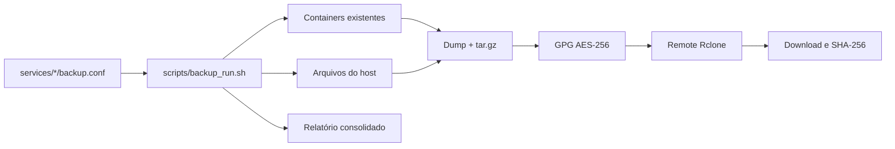

# Central de Backup CDC — Rclone

Este repositório contém a configuração GitOps e o motor Bash usado para copiar backups de serviços já existentes no host para um remote Rclone. Ele **não** contém uma aplicação Node.js, proxy Nginx, banco próprio ou uma stack Docker Compose.

## Fluxo implementado



O script:

- impede execuções simultâneas com `flock`;
- usa um diretório temporário privado por execução e limpeza por `trap`;
- aceita apenas chaves conhecidas no `.env` e nos `backup.conf`, sem executar esses arquivos;
- resolve containers por nome exato ou seletor estável que encontre exatamente um container ativo;
- gera dumps PostgreSQL, MySQL/MariaDB e SQLite, inclusive SQLite dentro de
  contêiner, ou arquiva caminhos do host e de contêiner;
- passa segredos ao GPG e aos clientes de banco sem incluí-los nos argumentos dos comandos de dump;
- envia o backup criptografado e o checksum, baixa novamente o objeto e confere SHA-256;
- só aplica retenção após existir mais que o mínimo configurado de backups remotos;
- retorna código diferente de zero quando qualquer serviço falha.

## Estrutura

```text
├── .env.example
├── .github/workflows/
├── docs/
├── scripts/backup_run.sh
├── services/<nome>/
│   ├── info.txt
│   └── backup.conf       # opcional; ausência significa serviço mapeado/inativo
└── tests/test_backup.sh
```

## Dependências do host

- Bash, `flock`, `tar`, GPG, Rclone, curl e `sha256sum`;
- Docker CLI com permissão para inspecionar e executar comandos nos containers;
- `sqlite3` quando houver configuração `BACKUP_TYPE="sqlite"`;
- remote Rclone configurado, por padrão `gdrive:Central de BKP`.

## Configuração

Copie `.env.example` para `.env`, restrinja o arquivo a `chmod 600` e preencha os valores. O `.env` não é versionado.

Chaves aceitas no `.env`:

- `GPG_PASSPHRASE` — obrigatória;
- `MATTERMOST_WEBHOOK_URL` — opcional;
- `DEFAULT_RETENTION_DAYS` — padrão 15;
- `MINIMUM_REMOTE_BACKUPS` — padrão 2;
- `RCLONE_REMOTE_ROOT` — padrão `gdrive:Central de BKP`;
- `BACKUP_LOCK_FILE` — padrão `/tmp/cdc-backup.lock`.

Chaves aceitas em `backup.conf`: `BACKUP_TYPE`, `DB_CONTAINER`, `DB_USER`,
`DB_NAME`, `SOURCE_PATH`, `RETENCAO_DIAS`, `FRAPPE_CONTAINER`, `FRAPPE_SITE` e
`EXTERNAL_REMOTE_SUBDIR`.

Tipos aceitos:

- `postgres`, `mysql` e `mariadb`: dump nativo do banco no contêiner;
- `sqlite`: cópia consistente de um arquivo SQLite no host;
- `container_sqlite`: cópia consistente de SQLite dentro de contêiner;
- `files` e `container_files`: pacote de arquivos no host ou no contêiner;
- `vaultwarden`: compatibilidade com a instalação SQLite legada;
- `frappe`: confirma o artefato diário produzido pelo job completo do Frappe.

## Execução

```bash
./scripts/backup_run.sh
./scripts/backup_run.sh "Wiki - Wiki.js"
./scripts/backup_run.sh "Wiki - Wiki.js" force
```

O modo `force` ignora somente a verificação de backup já realizado no dia; ele não ignora validações, checksum ou retenção.

## Validação local

```bash
bash -n scripts/backup_run.sh tests/test_backup.sh
bash tests/test_backup.sh
shellcheck scripts/backup_run.sh tests/test_backup.sh
```

Os testes usam comandos simulados e não acessam Docker, Rclone, Google Drive ou Mattermost reais.

## Limites operacionais

- Este repositório mantém uma cópia de produção e uma cópia persistente offsite. O temporário local é apagado e não deve ser contado como terceira cópia persistente. Uma política 3-2-1 exige outro destino ou mídia independente.
- Backups `files` não garantem consistência transacional de arquivos modificados durante o `tar`. Bancos ativos devem usar dump nativo, snapshot consistente ou pausa coordenada.
- O checksum detecta corrupção após o upload, mas não substitui testes periódicos de restauração nem armazenamento imutável.

Consulte [Política de backup](./docs/politica_backup.md),
[auditoria da VPS](./docs/auditoria_vps_2026-08-29.md),
[Vaultwarden em PostgreSQL](./docs/vaultwarden_postgresql.md),
[Lógica GitOps](./docs/logica_backup_gitops.md) e
[Troubleshooting](./docs/troubleshooting.md).
