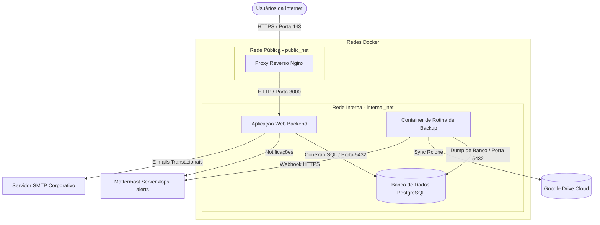

# Manual Técnico de Infraestrutura

Por que isolamos nossos serviços em redes virtuais distintas? Quando projetamos arquiteturas de microsserviços ou deploys em containers, a segurança lógica e a visibilidade de rede são cruciais. Permitir que um banco de dados de produção se comunique diretamente com a internet pública expõe a infraestrutura a vetores desnecessários de ataque. Este manual orienta a arquitetura de containers do projeto, fornecendo modelos completos e isolados de orquestração Docker, variáveis de ambiente higienizadas e testes de integração de rede.

---

## 1. Visão Geral da Arquitetura (Diagrama Mermaid)

O fluxo abaixo demonstra a separação entre redes públicas e internas, bem como os fluxos de dados de tráfego de usuários, notificações operacionais e backups automatizados:



---

## 2. Configuração de Orquestração (`docker-compose.yml`)

Este arquivo de orquestração implementa duas redes virtuais isoladas: `public_net` (acessível pelo proxy reverso e pelo mundo externo) e `internal_net` (onde residem o banco de dados e as ferramentas operacionais, bloqueando qualquer entrada de tráfego direto da internet).

Crie o arquivo `docker-compose.yml` na raiz do projeto com o conteúdo abaixo:

```yaml
version: '3.8'

services:
  nginx-proxy:
    image: nginx:1.25-alpine
    container_name: bkp_rclone_nginx
    ports:
      - "80:80"
      - "443:443"
    volumes:
      - ./infra/nginx/nginx.conf:/etc/nginx/nginx.conf:ro
      - ./infra/nginx/certs:/etc/nginx/certs:ro
    networks:
      - public_net
    depends_on:
      web-app:
        condition: service_healthy
    restart: always

  web-app:
    image: node:18-alpine
    container_name: bkp_rclone_app
    environment:
      - NODE_ENV=production
      - PORT=3000
      - DB_HOST=postgres-db
      - DB_USER=${DB_USER}
      - DB_PASSWORD=${DB_PASSWORD}
      - DB_NAME=${DB_NAME}
      - SMTP_HOST=${SMTP_HOST}
      - SMTP_PORT=${SMTP_PORT}
      - SMTP_USER=${SMTP_USER}
      - SMTP_PASSWORD=${SMTP_PASSWORD}
      - MATTERMOST_WEBHOOK_URL=${MATTERMOST_WEBHOOK_URL}
    networks:
      - public_net
      - internal_net
    healthcheck:
      test: ["CMD", "wget", "--no-verbose", "--tries=1", "--spider", "http://localhost:3000/health"]
      interval: 30s
      timeout: 10s
      retries: 3
    restart: always

  postgres-db:
    image: postgres:15-alpine
    container_name: bkp_rclone_db
    environment:
      - POSTGRES_USER=${DB_USER}
      - POSTGRES_PASSWORD=${DB_PASSWORD}
      - POSTGRES_DB=${DB_NAME}
    volumes:
      - postgres_data:/var/lib/postgresql/data
    networks:
      - internal_net
    healthcheck:
      test: ["CMD-SHELL", "pg_isready -U $$POSTGRES_USER -d $$POSTGRES_DB"]
      interval: 10s
      timeout: 5s
      retries: 5
    restart: always

  backup-scheduler:
    image: alpine:3.18
    container_name: bkp_rclone_backup
    volumes:
      - ./scripts:/scripts:ro
      - ./config/rclone:/config/rclone:ro
      - ./config/gpg:/config/gpg:ro
      - postgres_data:/var/lib/postgresql/data:ro
    environment:
      - DB_HOST=postgres-db
      - DB_USER=${DB_USER}
      - DB_PASSWORD=${DB_PASSWORD}
      - DB_NAME=${DB_NAME}
      - MATTERMOST_WEBHOOK_URL=${MATTERMOST_WEBHOOK_URL}
      - RCLONE_DRIVE_FOLDER=${RCLONE_DRIVE_FOLDER}
      - GPG_PASSPHRASE=${GPG_PASSPHRASE}
    networks:
      - internal_net
    entrypoint: ["/bin/sh", "-c", "echo '0 2 * * * /scripts/backup_run.sh' > /etc/crontabs/root && crond -f -l 2"]
    restart: always

volumes:
  postgres_data:
    driver: local

networks:
  public_net:
    driver: bridge
  internal_net:
    driver: bridge
    internal: true
```

---

## 3. Configuração de Ambiente (`.env.example`)

Copie o conteúdo abaixo para um novo arquivo `.env.example` na raiz do projeto para servir de guia de parametrização da infraestrutura:

```ini
# Configuração de Ambiente (production / staging / development)
NODE_ENV=production
APP_VERSION=v1.0.0

# Conexão com o Banco de Dados (PostgreSQL)
DB_USER=app_db_user
DB_PASSWORD=<TODO: DEFINIR — Senha forte do banco de dados para producao>
DB_NAME=bkp_rclone_production
DB_PORT=5432

# Servidor de E-mail (SMTP Transacional)
SMTP_HOST=smtp.sendgrid.net
SMTP_PORT=587
SMTP_USER=apikey
SMTP_PASSWORD=<TODO: DEFINIR — Credencial/API Key do gateway de emails>

# Comunicação e Alertas
MATTERMOST_WEBHOOK_URL=<TODO: DEFINIR — URL oficial do webhook de entrada do Mattermost>

# Parâmetros de Backup Offsite e Segurança
RCLONE_DRIVE_FOLDER=backups_db_production
GPG_PASSPHRASE=<TODO: DEFINIR — Senha simetrica de criptografia dos arquivos de dump>
```

---

## 4. Teste de Integração de Webhooks do Mattermost

Para certificar-se de que a comunicação local com os canais do Mattermost está operando livre de bloqueios de firewall ou autenticação, execute o comando curl a seguir no shell do servidor (substituindo a URL pela correspondente no arquivo `.env` de produção):

```bash
curl -i -X POST -H 'Content-Type: application/json' \
-d '{
  "username": "Teste Infra",
  "icon_url": "https://mattermost.com/wp-content/uploads/2022/02/icon.png",
  "text": "#### :white_check_mark: Teste de Conectividade de Infraestrutura\nO servidor de banco e aplicação está respondendo corretamente aos testes de webhook do Mattermost."
}' \
<MATTERMOST_WEBHOOK_URL>
```
**Critério de Validação:** A resposta do servidor Mattermost deve ser obrigatoriamente HTTP status **200 OK** ou **201 Created**. Caso receba erro 400 ou 403, consulte a seção 2 do documento [troubleshooting.md](./troubleshooting.md).

---

## 5. Tabela de Mapeamento de Portas e Registros DNS

Para que a aplicação seja acessível de forma externa e segura, as seguintes portas físicas e registros no servidor DNS institucional devem estar devidamente provisionados:

### 5.1 Portas de Rede Locais
| Serviço Docker | Porta Container | Porta Host | Protocolo | Escopo |
| :--- | :--- | :--- | :--- | :--- |
| `nginx-proxy` | 80 | 80 | TCP | Público (Internet) |
| `nginx-proxy` | 443 | 443 | TCP | Público (Internet) |
| `web-app` | 3000 | Nenhuma | TCP | Isolado (Apenas redes Docker) |
| `postgres-db` | 5432 | Nenhuma | TCP | Isolado (Apenas rede interna) |

### 5.2 Registros DNS Necessários
| Entrada / Hostname | Tipo | Destino | Finalidade |
| :--- | :--- | :--- | :--- |
| `<TODO: DEFINIR — ex: app.projeto.com>` | A | `<SERVER_IP_PROD>` | Roteamento principal do Nginx HTTPS |
| `<TODO: DEFINIR — ex: staging.projeto.com>`| A | `<SERVER_IP_STAGING>` | Roteamento de ambiente de testes HTTPS |
| `<TODO: DEFINIR — ex: mx.projeto.com>` | MX | `<SMTP_PROVIDER_IP>` | Registro do servidor de envio de e-mails |
